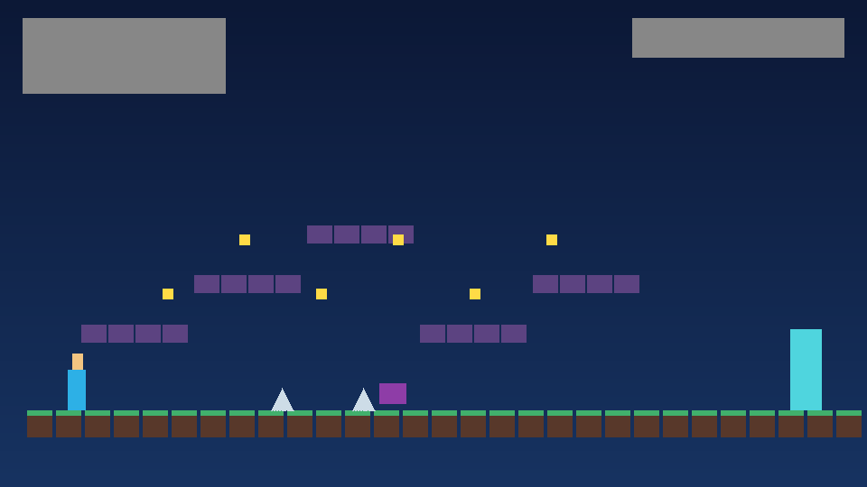
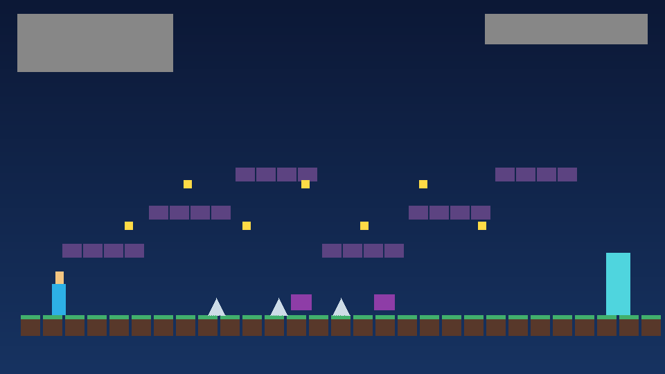
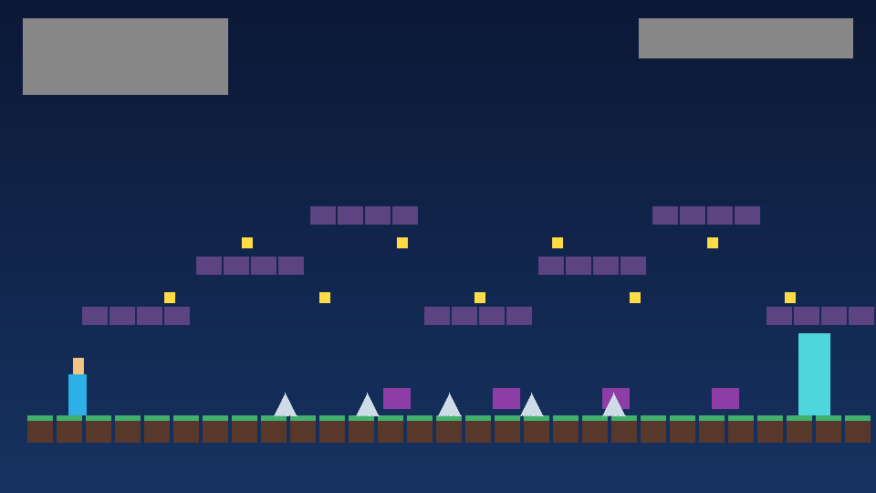
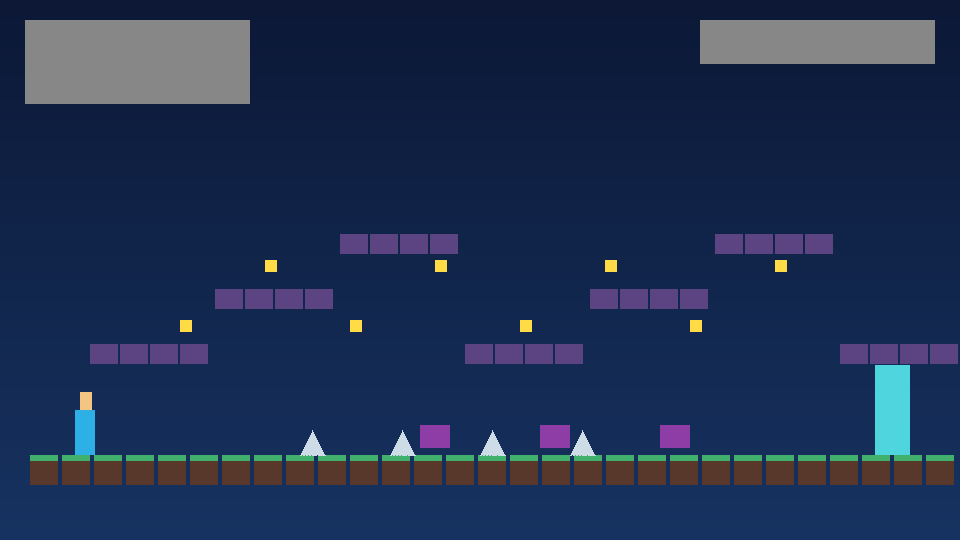

# Vale dos Cristais

**Vale dos Cristais** e um jogo de plataforma 2D feito em Unity/C# para entrega academica. O tema e uma aventura em cavernas e ruinas cristalinas: o jogador precisa restaurar o Cristal-Mor atravessando fases com escadas, inimigos, espinhos e coletaveis.

## Mecanicas implementadas

- Movimento lateral com **andar** e **correr**.
- **Pulo** com efeito sonoro.
- **Escalada** em escadas usando o eixo vertical.
- Animacoes por sprites para:
  - personagem parado, andando, correndo, pulando, escalando e sofrendo dano;
  - inimigos patrulhando;
  - moedas, gemas, vidas e portal de fim de fase.
- HUD funcional com:
  - vidas;
  - pontuacao;
  - coletaveis da fase;
  - nome da fase e mensagens de feedback.
- Feedback visual e sonoro:
  - particulas e som ao coletar moedas/gemas/vidas;
  - piscada vermelha, particulas e som ao sofrer dano;
  - som ao concluir uma fase.
- 4 fases com dificuldade progressiva:
  1. Bosque de Entrada
  2. Mina dos Ecos
  3. Ruinas Suspensas
  4. Pico do Cristal-Mor
- Obstaculos e desafios:
  - espinhos;
  - inimigos patrulhando;
  - plataformas em alturas diferentes;
  - escadas para rotas verticais;
  - coletaveis posicionados para incentivar dominio de corrida, salto e escalada.

## Controles

| Acao | Teclado |
| --- | --- |
| Andar | `A/D` ou setas esquerda/direita |
| Correr | `Shift` + direcao |
| Pular | `Espaco` |
| Escalar | `W/S` ou setas cima/baixo em uma escada |
| Reiniciar fase | `R` |
| Sair do executavel | `Esc` |

## Como abrir o projeto no Unity

1. Instale o **Unity 2022.3 LTS** ou versao compativel.
2. Abra o Unity Hub.
3. Clique em **Add / Add project from disk**.
4. Selecione a pasta raiz deste repositorio.
5. Aguarde o Unity importar os assets.
6. Abra a cena `Assets/Scenes/Main.unity`.
7. Clique em **Play**.

O jogo e montado em runtime pelo script `GameManager`, entao a cena principal e propositalmente simples. Os niveis estao definidos em `Assets/Scripts/LevelData.cs`.

## Como compilar e rodar o executavel Windows

### Pela interface do Unity

1. Abra o projeto no Unity.
2. Va em **File > Build Settings**.
3. Selecione **PC, Mac & Linux Standalone**.
4. Em **Target Platform**, escolha **Windows** e arquitetura **x86_64**.
5. Confirme que `Assets/Scenes/Main.unity` esta na lista de cenas.
6. Clique em **Build**.
7. Escolha a pasta `Builds/Windows`.
8. Execute `ValeDosCristais.exe`.

### Pelo menu automatizado do projeto

No Unity Editor, use:

```text
Build > Vale dos Cristais > Windows 64-bit
```

Isso chama `Assets/Editor/BuildWindows.cs` e gera:

```text
Builds/Windows/ValeDosCristais.exe
```

### Por linha de comando

Com o Unity instalado e disponivel no `PATH`:

```bash
Unity -quit -batchmode -projectPath . -executeMethod ValeDosCristais.EditorTools.BuildWindows.BuildWindows64
```

Depois, compacte a pasta exportada:

```powershell
Compress-Archive -Path Builds/Windows/* -DestinationPath Builds/ValeDosCristais-Windows.zip -Force
```

> Observacao: em ambiente headless/CI, o Unity precisa de uma licenca ativa antes do build. Se aparecer `No valid Unity Editor license found`, gere um arquivo `.alf` com `Unity -quit -batchmode -nographics -createManualActivationFile`, ative-o na pagina de licencas da Unity para obter um `.ulf` e importe com `Unity -quit -batchmode -nographics -manualLicenseFile caminho/Unity.ulf`. Arquivos `.alf` e `.ulf` nao devem ser commitados.

## Estrutura do repositorio

```text
Assets/
  Editor/BuildWindows.cs          Script de build Windows
  Prints/                         Prints ilustrativos das telas/fases
  Resources/Audio/                Trilha e efeitos sonoros originais
  Resources/Sprites/              Sprites pixel art originais
  Scenes/Main.unity               Cena principal
  Scripts/                        Codigo-fonte C# do jogo
Packages/manifest.json            Dependencias Unity
ProjectSettings/                  Configuracoes do projeto
Builds/README.md                  Instrucoes da pasta de builds
```

## Prints ilustrativos

### Fase 1



### Fase 2



### Fase 3


### Fase 4



### HUD e jogabilidade



## Creditos dos assets

Todos os sprites, prints ilustrativos e arquivos de audio incluidos no projeto foram gerados especificamente para esta entrega e sao originais do repositorio.

- Sprites: `Assets/Resources/Sprites`
- Audios/SFX/trilha: `Assets/Resources/Audio`
- Prints: `Assets/Prints`

Nao ha assets externos de terceiros nesta versao.

